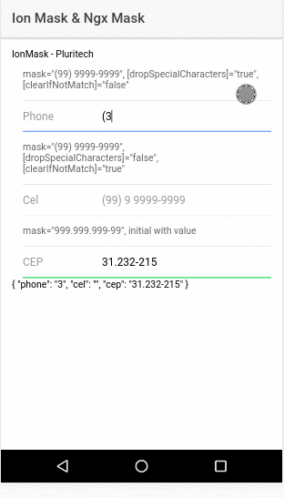

# ion-mask
  This library is based on service of awesome  https://github.com/JsDaddy/ngx-mask, as this dont work with Ionic 2+, we create ion-mask that gather https://github.com/JsDaddy/ngx-mask and  https://github.com/Pluritech/ion-currencymask .

<p align="center">
  
</p>

## Installation

To install this library, run:

```bash
$ npm install @pluritech/ion-mask --save
```

## Consuming your library

and then from your Ionic `AppModule`:

```typescript
import { NgModule } from '@angular/core';
import { BrowserModule } from '@angular/platform-browser';

import { IonicApp, IonicErrorHandler, IonicModule } from 'ionic-angular';
import { MyApp } from './app.component';

import { HomePage } from '../pages/home/home';


// Import your library
import { SampleModule } from 'ion-mask';

@NgModule({
  declarations: [
    MyApp,
    HomePage
  ],
  imports: [
    BrowserModule,

    // import the module
    IonMaskModule.forRoot()
  ],
  providers: [],
  bootstrap: [IonicApp],
  entryComponents: [
    MyApp,
    HomePage
  ]
})
export class AppModule { }
```

Once the library is imported, you can use the compenents ion-input-mask

```xml
<!-- You can now use your library component in app.component.html -->
  <form [formGroup]="formTest" novalidate>
    <ion-input-mask
      label="Phone"
      placeholder="(99) 9999-9999"
      typeLabel="fixed"
      formControlName="phone"
      mask="(99) 9999-9999">
    </ion-input-mask>
    <ion-input-mask
      label="Cel"
      placeholder="(99) 9 9999-9999"
      typeLabel="fixed"
      formControlName="cel"
      [clearIfNotMatch]="true"
      [dropSpecialCharacters]="false"
      mask="(99) 9 9999-9999">
    </ion-input-mask>
    <ion-input-mask
      label="CEP"
      placeholder="999.999.999-99"
      typeLabel="fixed"
      formControlName="cep"
      [clearIfNotMatch]="true"
      [lastChild]="true"
      [dropSpecialCharacters]="false"
      mask="99.999-999">
    </ion-input-mask>
  </form>
```

## Development

To generate all `*.js`, `*.d.ts` and `*.metadata.json` files:

```bash
$ npm run build
```

To lint all `*.ts` files:

```bash
$ npm run lint
```

## License

MIT © [Lucas Correa](mailto:lucasccorrea@gmail.com)
